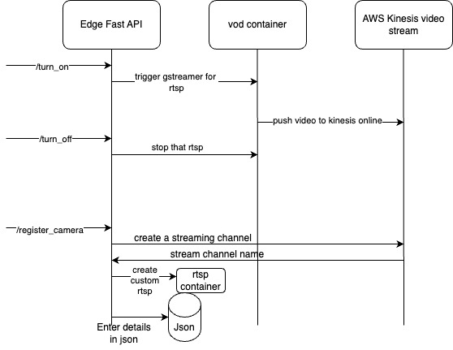

# Video on Demand pipeline

## Content
- [Video on Demand pipeline](#video-on-demand-pipeline)
  - [Content](#content)
  - [Basic flow](#basic-flow)
  - [Pre requisites](#pre-requisites)
  - [Installation and bringing containers up.](#installation-and-bringing-containers-up)
  - [Registering a new camera](#registering-a-new-camera)
  - [files and details](#files-and-details)
  - [setting up webcam as a cctv camera with rtsp:](#setting-up-webcam-as-a-cctv-camera-with-rtsp)
  - [Basic Debugging checks.](#basic-debugging-checks)
    - 
      - [references:](#references)

## Basic flow

## Pre requisites

1. Ubuntu 22.04
2. Docker
3. Docker compose
4. aws accesskey and secret key with kinesis video stream policy added.

## Installation and bringing containers up.
1. setting up environment variables.  file path : `./.env` set the following variables
   1. `ACCESSKEY`
   2. `SECRETKEY`
   3. `AWSREGION`

2. run the following command in the `./` folder to build and run docker images. Note : running it first time will take a long time as the images are built from scratch. 
   `docker compose up`

3. To stop the running software run the following command in the `./` folder.
    `docker compose down`

4. For fresh setup always delete `cameras.json` and `config.json` and then do docker compose up.

## Registering a new camera

1. got to `http://localhost:5254/register_camera`
2. give **unique** name to each camera, Note that the stream name will be the same as camera name. TODO : check if the name is not unique raise an error.
3. note the device_id displayed on the page
4. use`camera name` and `device_id` and execute `/turn_on_vod` in `http://localhost:5254/docs` to start streaming.
5.  use`camera name` and `device_id` and execute `/turn_off_vod` in `http://localhost:5254/docs` to stop streaming.

## files and details

1. `./edgefastapi/src/config/cameras.json` -  holds the local settings for all the cameras. Holds the information of the local custom rtsp urls.
2. `./edgefastapi/src/config/config.json`  -  holds the unique device id.

## setting up webcam as a cctv camera with rtsp:

1. `wget https://github.com/aler9/rtsp-simple-server/releases/download/v0.16.0/rtsp-simple-server_v0.16.0_linux_amd64.tar.gz` download rtsp server 
2. `tar -xzvf rtsp-simple-server_v0.16.0_linux_amd64.tar.gz` unzip
3. `RTSP_RTSPADDRESS=192.168.XXX.XXX:8554 ./rtsp-simple-server` running the server on the address and port. give machine ip
4. `sudo apt-get install v4l-utils` v41 utils
5. `sudo v4l2-ctl — list-devices` list devices
6. `sudo ffmpeg -f v4l2 -framerate 25 -video_size 640x480 -i /dev/video0 -c:v libx264 -f rtsp -rtsp_transport tcp rtsp://192.168.XXX.XXX:8554/mystream` push video frames to the rtsp server at /mystream endpoint. Note to make sure you have libx264 -which gives h264 encoding equivalent in cctv.

## Basic Debugging checks.

### 

#### references:
https://kaustavmukherjee-66179.medium.com/convert-any-webcam-into-ipcam-in-2-minutes-using-rtsp-server-and-ffmpeg-a27414f08af5